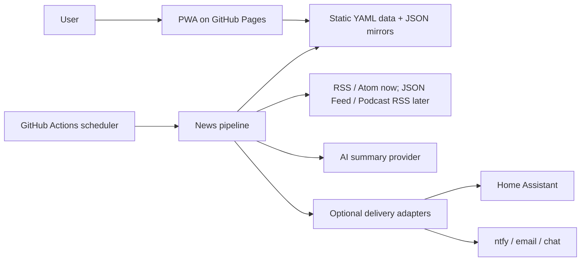
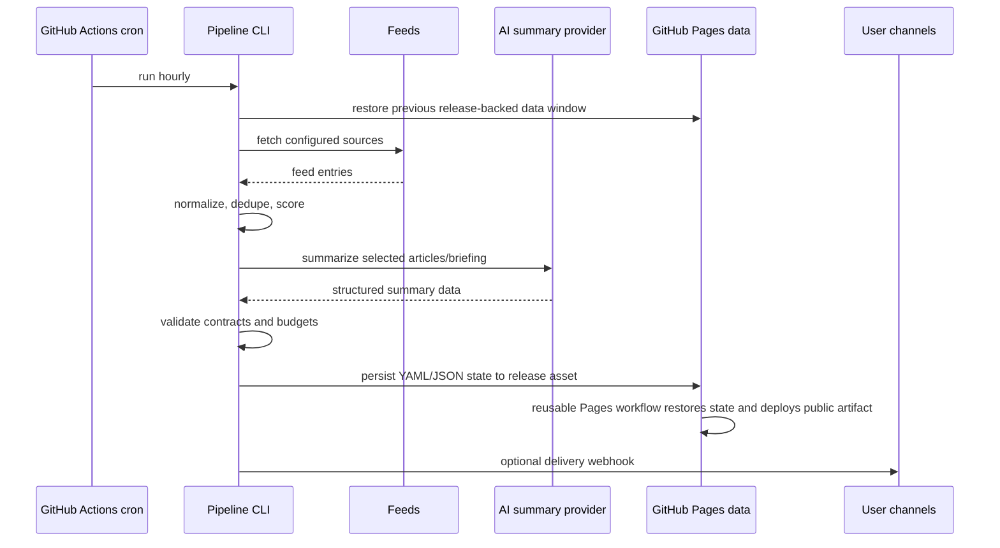

# Architecture

## Implemented architecture summary

Wazzup currently uses a GitHub-native static architecture:

- GitHub Actions runs the backend pipeline hourly.
- The Python pipeline fetches sources, normalizes content, deduplicates and ranks items, calls an AI summary provider, and writes versioned YAML outputs with JSON browser mirrors.
- GitHub Pages hosts both the minimal PWA and the generated YAML/JSON data.
- A dedicated GitHub Release asset stores the rolling generated-data state between scheduled runs.
- Optional delivery adapters are not implemented yet; services such as Home Assistant, ntfy, email, Teams, or Slack remain future work.
- The core domain contracts remain independent from GitHub Actions and GitHub Pages so they can later power a REST API, agent tool, or MCP server.
- Commits must follow Conventional Commits so release-please can be added without history cleanup.

Implementation deviations from the original target are intentional for MVP simplicity:

- Backend runtime is Python 3.11+ under [../src/wazzup](../src/wazzup).
- Frontend is vanilla HTML/CSS/JavaScript under [../public](../public); there is no frontend build step yet.
- YAML is the canonical generated state format; JSON files are generated browser mirrors.
- Pages state restoration supports tokenless public release-asset downloads because reusable workflow string inputs cannot reliably inject `GH_TOKEN` for nested shell commands.
- News hourly requests Copilot CLI by default, but falls back to the deterministic fake provider if Copilot token secrets are missing.

## Context diagram



## Runtime components

| Component | Responsibility | MVP implementation |
| --- | --- | --- |
| Source configuration | Defines feeds, categories, weights, headers, and interest hints. | [../config/sources.yml](../config/sources.yml) and [../config/interests.yml](../config/interests.yml). |
| Fetcher | Retrieves RSS and Atom XML feeds. | `urllib.request` based Python fetcher in [../src/wazzup/feeds.py](../src/wazzup/feeds.py). |
| Normalizer | Converts source entries into `ContentItem` records. | Pure functions with fixtures. |
| Deduplicator | Groups duplicate or near-duplicate articles. | Canonical URL + raw ref/GUID + normalized title/day transitive groups. |
| Ranker | Scores items against interests, source quality, recency, and coverage. | Deterministic scoring plus optional AI reranking later. |
| Summarizer | Generates article and briefing summaries. | AI provider abstraction with prompt versioning. |
| Publisher | Writes canonical static YAML, JSON browser mirrors, source health, `latest`, and `manifest` files. | [../src/wazzup/publisher.py](../src/wazzup/publisher.py). |
| State store | Persists generated data across scheduled runs without commits. | `news-state` GitHub Release asset `wazzup-state.zip`. |
| Delivery adapters | Pushes selected briefings to external channels. | Not implemented yet. |
| Frontend | Displays latest briefing and source health. | Static vanilla PWA in [../public](../public). |

## Pipeline flow



## Repository structure

```text
config/
  sources.yml
  interests.yml
docs/
src/
  wazzup/
    ai.py               # provider interface, fake provider, Copilot CLI provider
    build_info.py       # generated build metadata for footer/SW cache version
    config.py           # YAML config loading/validation
    feeds.py            # RSS/Atom fetch, parse, canonicalization, dedupe
    models.py           # dataclass domain contracts
    pipeline.py         # CLI orchestration
    publisher.py        # YAML canonical output and JSON mirrors
    scoring.py          # deterministic ranking
    validate_data.py    # generated-data validation
public/
  index.html
  styles.css
  app.js
  sw.js
  manifest.webmanifest
tests/
  fixtures/
.github/workflows/
  ci.yml
  lint.yml
  news-hourly.yml
  pages.yml
```

Future work can split the Python modules into deeper packages if complexity grows, but the current flat package keeps the MVP easy to inspect.

## Domain contracts

### `ContentItem`

Represents one normalized source item.

Required fields:

- `schemaVersion`
- `id`
- `sourceId`
- `sourceType`
- `title`
- `url`
- `canonicalUrl`
- `publishedAt`
- `discoveredAt`
- `authors`
- `tags`
- `language`
- `summary`
- `contentHash`
- `rawRef`

### `ScoredItem`

Extends `ContentItem` with ranking metadata.

Required fields:

- `score`
- `scoreReasons`
- `matchedInterests`
- `duplicateGroupId`
- `freshnessBucket`

### `Briefing`

Represents a generated user-facing summary.

Required fields:

- `schemaVersion`
- `id`
- `kind`: `hourly`, `morning`, `evening`, or `manual`
- `windowStart`
- `windowEnd`
- `generatedAt`
- `timezone`
- `headline`
- `sections`: each bullet keeps a backward-compatible `text` field and may include structured `title` and `description` fields for the PWA card layout.
- `sourceItemIds`
- `citations`
- `model`
- `promptVersion`
- `costEstimate`

### `DeliveryTarget`

Represents an optional outgoing notification channel.

Required fields:

- `id`
- `kind`: `home-assistant-webhook`, `ntfy`, `email`, `slack`, `teams`, or `custom-webhook`
- `enabled`
- `briefingKinds`
- `secretRef`

## Static data layout

```text
public/data/
  latest.yaml                 # canonical
  latest.json                 # browser mirror
  manifest.yaml               # canonical
  manifest.json               # browser mirror
  sources/status.yaml         # canonical
  sources/status.json         # browser mirror
  articles/YYYY/MM/DD.yaml    # canonical
  articles/YYYY/MM/DD.json    # browser mirror
  briefings/YYYY/MM/DD/hourly-HH.yaml
  briefings/YYYY/MM/DD/hourly-HH.json
  briefings/YYYY/MM/DD/morning.yaml
  briefings/YYYY/MM/DD/morning.json
  briefings/YYYY/MM/DD/evening.yaml
  briefings/YYYY/MM/DD/evening.json
  archives/YYYY-MM.yaml
public/build-info.json        # generated deployment metadata for footer/SW version
```

The scheduled workflow must not commit generated article or briefing YAML/JSON to `main`. It restores the previous `public/data` window from a dedicated `news-state` GitHub Release asset, generates new data, enforces 35-day retention, and uploads the updated release asset. The separate Pages workflow then uses the reusable Pages deployment from `DevSecNinja/.github` to restore that same release asset and deploy the static files to GitHub Pages.

YAML is the canonical persisted state format because it is easier to inspect and edit when debugging release assets. JSON remains a generated transport mirror because browsers can consume it without adding a YAML parser dependency to the PWA.

Why the release contains both YAML and JSON today:

- YAML is the standard human/operator format for generated state.
- JSON is a generated compatibility mirror for the browser, Home Assistant-style consumers, and simple validation tooling.
- Keeping both avoids adding a YAML parser dependency to the PWA while preserving human-readable release assets.
- If the duplicated files become too noisy, the likely simplification is to switch the canonical generated output to JSON-only rather than making the browser parse YAML.

Release-state restore behavior:

- In `News hourly`, [../Taskfile.yml](../Taskfile.yml) uses `GH_TOKEN` and `gh release download` to restore prior state, then `gh release upload --clobber` or `gh release create` to persist updated state.
- In `Pages`, the reusable workflow cannot receive a working token through a string input, so `task pages:build` restores `wazzup-state.zip` through the public release download URL when no `GH_TOKEN`/`GITHUB_TOKEN` is available.
- `pages:build` sets `STATE_REQUIRED=true`; if retained state cannot be restored, deployment fails explicitly instead of uploading an empty app data directory.
- The current state release is intentionally one mutable operational release, not one release per hour. Hourly releases would create thousands of releases per year and duplicate the generated-data churn problem in a different GitHub surface. A better future archive is one immutable daily or monthly recap release whose body contains a human-readable digest and links to archived assets.

Rejected alternatives:

- Committing generated data to `main`: too much history churn for hourly outputs.
- Committing generated data to a `news` branch: avoids polluting `main`, but still creates thousands of commits per year and adds branch-management complexity.
- Pages artifact only: simple, but does not provide a durable state input for the next scheduled run.

## Deduplication strategy

Deduplication is a first-class pipeline step because duplicate RSS entries were a primary frustration with previous feed tooling.

The MVP deduplicates before scoring using transitive duplicate groups:

1. Canonical URL key after removing common tracking parameters and fragments.
2. Feed GUID/raw reference key when available.
3. Normalized title plus publication day key for syndicated or mirrored stories with different URLs.

When multiple items land in the same group, the winner is selected by source priority, summary richness, and publication timestamp. The Microsoft Threat Intelligence topic feed currently has elevated source priority over the broader Microsoft Security Blog feed. Future improvements can add semantic title similarity, source-specific canonicalization rules, and duplicate-group metadata in the published output.

### `latest.yaml` and `latest.json`

Small pointer file consumed by the frontend and Home Assistant. YAML is canonical; JSON is the PWA mirror.

Example fields:

- `latestHourlyBriefingUrl`
- `latestMorningBriefingUrl`
- `latestEveningBriefingUrl`
- `generatedAt`
- `health`

## Scheduling model

GitHub Actions cron runs in UTC and can be delayed. The workflow should run hourly and let the pipeline decide whether a morning or evening briefing is due in the configured IANA time zone.

Recommended defaults:

- `timezone`: `Europe/Amsterdam`
- `morningBriefingLocalTime`: `07:00`
- `eveningBriefingLocalTime`: `20:00`
- `hourlyBriefing`: enabled for notable changes only

This avoids daylight-saving issues in workflow YAML.

Current implementation note: automatic due-time selection is not implemented yet. [../.github/workflows/news-hourly.yml](../.github/workflows/news-hourly.yml) defaults to `hourly` and exposes `forceBriefing` values `hourly`, `morning`, and `evening` for manual dispatch. [../src/wazzup/pipeline.py](../src/wazzup/pipeline.py) computes correct hourly/morning/evening windows for the selected kind.

## Implementation sequence

Build the first implementation as an end-to-end thin slice instead of isolated layers:

1. Validate [config/sources.yml](../config/sources.yml) and fetch the three initial RSS feeds.
2. Normalize feed entries into versioned `ContentItem` records.
3. Score and select a small set of articles using deterministic rules.
4. Generate an English briefing through the Copilot CLI provider when configured, with a fake provider for tests and tokenless fallback.
5. Write static YAML and JSON mirrors to the Pages data layout.
6. Render the latest briefing in a minimal PWA.
7. Add CI gates and a scheduled workflow skeleton.

This sequence keeps the system demonstrable from the beginning and limits architectural drift.

## AI summarization integration

Use a provider interface instead of calling a provider directly from pipeline logic:

```text
AiSummaryProvider.generateStructuredSummary(request) -> SummaryResponse
```

Implemented and planned provider order:

| Provider | Best use | Notes |
| --- | --- | --- |
| Copilot CLI | Default requested scheduled summarization provider. | Implemented with `copilot -p`, `COPILOT_GITHUB_TOKEN`, `--no-ask-user`, and narrow `--allow-tool` permissions. Requires `COPILOT_REQUESTS_PAT` or `COPILOT_GITHUB_TOKEN` secret. |
| Fake provider | Tests, local deterministic development, and tokenless scheduled fallback. | Implemented and used by CI. |
| Azure OpenAI / OpenAI / GitHub Models | Direct API-based summarization with clearer model and token accounting. | Planned. |
| Ollama / Foundry | Local/self-contained or platform-specific experiments. | Planned. |

The pipeline should prepare a provider-neutral summary request, then adapters translate it into the provider-specific invocation. For Copilot CLI, the adapter should write a prompt bundle to a temporary file, run the CLI in programmatic mode, request structured JSON output, and validate the output before publishing.

Implementation requirements and current status:

- Validate provider output with JSON Schema or a runtime type validator. Runtime validation is implemented in [../src/wazzup/ai.py](../src/wazzup/ai.py); formal schema files are deferred.
- Keep prompt templates versioned.
- Include citations in the request and require cited output.
- Cache article-level summaries by `contentHash` and `promptVersion`. Deferred.
- Enforce max input items, max tokens, and monthly cost budget. Max input items are enforced; token/monthly cost accounting is deferred.
- Provide a fake deterministic provider for tests. Implemented.
- Restrict Copilot CLI tool permissions to the minimum needed, and avoid giving it write access outside a temporary output directory.
- Track provider metadata in every briefing, including provider type, model if known, prompt version, token or request estimate, and validation result.

## Frontend architecture

Use a small static PWA:

- `index.html` with semantic sections.
- CSS custom properties for theming.
- Vanilla JavaScript for data loading and rendering.
- Service Worker for static asset and recently fetched data caching.
- No runtime framework in the MVP unless complexity proves it adds clear design or functionality value. If introduced, keep dependencies low, stable, and well-known.

Implemented frontend behavior:

- The homepage renders a single rolling briefing for the current local day. Hourly runs start the item set fresh at local midnight, then include all retained feed items published between local midnight and the current run.
- Each briefing item is displayed as a title plus short description with citations, instead of forcing the reader through one long paragraph.
- Each item also receives visible temperature metadata (`hot`, `warm`, or `cool`) derived from the existing relevance score. The PWA uses this for an icon, border, and title color so important items are scannable while scrolling.
- The hero headline is capped in the PWA and the duplicate briefing headline is replaced with a stable “Today’s rolling briefing” heading.
- The sidebar shows source health and the latest retained summary from yesterday, rendered inline rather than linking to generated JSON.
- It consumes JSON mirrors, not canonical YAML, to avoid a browser-side YAML parser dependency.
- It supports opt-in local notifications when the open/installed PWA observes a new briefing URL. True background push notifications require stored subscriptions and are deferred.
- The service worker cache is versioned by the `buildId` query string from `build-info.json`, uses `updateViaCache: 'none'`, and supports offline reading for assets/data that have already been fetched.

A dedicated daily briefing kind is not implemented yet. The current site behavior is a rolling current-day briefing plus an inline yesterday card that renders the latest retained roll-up from yesterday.

## Notification architecture

### MVP

- PWA displays latest data when opened.
- No external delivery channel is required for MVP.

### Later

- Web Push service with subscription persistence.
- User preferences per delivery channel.
- Mobile push through ntfy or a dedicated push provider.

## Release and commit conventions

All commits must follow Conventional Commits, for example:

- `docs: add product requirements and architecture`
- `feat: ingest RSS sources`
- `fix: handle malformed feed dates`
- `test: add briefing window coverage`

This is a hard project convention because release-please will be introduced later. Pull requests should be squash-merged with a Conventional Commit title, or individual commits should already comply.

## Home Assistant integration

Initial integration options:

1. REST sensor polling `public/data/latest.json`.
2. Webhook delivery from GitHub Actions after briefing generation.
3. MQTT discovery for richer state and automation.

Example automations:

- Speak the morning briefing through a TTS service.
- Show the top 3 headlines on a dashboard card.
- Trigger a notification only when high-priority topics are detected.

## Podcast integration

Podcast support should reuse the source adapter pattern:

- Parse podcast RSS episodes.
- Detect transcript links from Podcasting 2.0 tags, show notes, or known provider metadata.
- Normalize episodes as `ContentItem` with `sourceType: podcast`.
- Score episodes separately from articles to avoid over-ranking long-form content.
- Generate a `shouldListen` recommendation with reasons and estimated listening time.

Audio transcription should be opt-in due to cost, latency, and copyright considerations.

## Future API and MCP readiness

To avoid rework, the MVP should treat static YAML contracts as canonical, with JSON mirrors as browser/API compatibility output. A later API or MCP server can expose the same operations:

- `list_briefings(window, kind)`
- `get_briefing(id)`
- `list_items(window, sourceType, interests)`
- `explain_score(itemId)`
- `search_items(query)`
- `mark_saved(itemId)` if user state is later introduced

The future MCP server should depend on the domain contracts in [../src/wazzup](../src/wazzup), not scrape the frontend.

## Security and privacy

- Store AI provider keys and delivery secrets in GitHub Actions secrets.
- Do not log full prompts if they may contain private interests or paid content.
- Redact provider responses in debug logs unless explicitly enabled.
- Treat Pages output as public for the MVP and avoid publishing secrets, private notes, or full article text.
- Respect source terms and avoid publishing full article text unless licensed.
- Prefer summaries and links over copied article content.

## Key risks and mitigations

| Risk | Mitigation |
| --- | --- |
| GitHub Pages exposes personal interests | Public output is accepted for MVP; keep source preferences and prompts minimal and support private/static alternatives later. |
| Repository bloat from generated data | Store rolling state in a GitHub Release asset and deploy Pages artifacts without committing generated YAML/JSON. |
| AI hallucinations | Require citations, validate structured output, keep source links visible. |
| AI provider cost spikes | Cache summaries, cap item count, track token/request estimates. |
| Scheduled workflows delayed | Treat schedules as best-effort and compute windows from timestamps. |
| Feed parsing failures | Isolate source failures and publish source health. |
| Copyright issues | Store metadata and summaries only; avoid republishing full content. |
