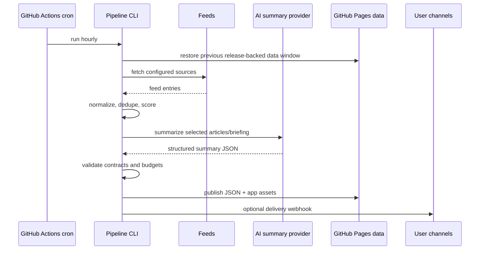

# Architecture

## Recommended architecture summary

Use a GitHub-native static architecture for the MVP:

- GitHub Actions runs the backend pipeline hourly.
- The pipeline fetches sources, normalizes content, ranks items, calls an AI summary provider, and writes versioned JSON outputs.
- GitHub Pages hosts both the minimal PWA and the generated JSON data.
- A dedicated GitHub Release asset stores the rolling generated-data state between scheduled runs.
- Optional delivery adapters can later send briefings to services such as Home Assistant, ntfy, email, Teams, or Slack.
- The core domain contracts remain independent from GitHub Actions and GitHub Pages so they can later power a REST API, agent tool, or MCP server.
- Commits must follow Conventional Commits so release-please can be added without history cleanup.

## Context diagram


## Runtime components

| Component | Responsibility | MVP implementation |
| --- | --- | --- |
| Source configuration | Defines feeds, categories, weights, and credentials references. | YAML or JSON config committed to the repo. |
| Fetcher | Retrieves RSS, Atom, JSON Feed, GitHub release feeds, and podcast feeds. | CLI command run by GitHub Actions. |
| Normalizer | Converts source entries into `ContentItem` records. | Pure functions with fixtures. |
| Deduplicator | Groups duplicate or near-duplicate articles. | Canonical URL + GUID + normalized title heuristics. |
| Ranker | Scores items against interests, source quality, recency, and coverage. | Deterministic scoring plus optional AI reranking later. |
| Summarizer | Generates article and briefing summaries. | AI provider abstraction with prompt versioning. |
| Publisher | Writes static JSON indexes and deployable frontend assets. | GitHub Pages artifact deployment. |
| Delivery adapters | Pushes selected briefings to external channels. | Optional webhooks initially. |
| Frontend | Displays latest, hourly, morning, evening, saved, and source views. | Static TypeScript PWA. |

## Pipeline flow



## Proposed repository structure

```text
config/
  sources.yml
  interests.yml
docs/
src/
  core/                 # domain types, scoring, dedupe, contracts
  sources/              # RSS, Atom, JSON Feed, podcast adapters
  ai/                   # provider interface, prompts, response validation
  pipeline/             # CLI orchestration
  delivery/             # optional webhook/email/Home Assistant adapters
  web/                  # static frontend
tests/
  fixtures/
  unit/
  integration/
  contract/
.github/workflows/
  ci.yml
  news-hourly.yml
  pages.yml
```

This structure is the implementation target. The current MVP implements the core pipeline, static PWA, tests, and GitHub Actions workflow skeleton; future work can fill in richer delivery adapters, API surfaces, and podcast support.

## Domain contracts

### `ContentItem`

Represents one normalized source item.

Required fields:

- `schemaVersion`
- `id`
- `sourceId`
- `sourceType`
- `title`
- `url`
- `canonicalUrl`
- `publishedAt`
- `discoveredAt`
- `authors`
- `tags`
- `language`
- `summary`
- `contentHash`
- `rawRef`

### `ScoredItem`

Extends `ContentItem` with ranking metadata.

Required fields:

- `score`
- `scoreReasons`
- `matchedInterests`
- `duplicateGroupId`
- `freshnessBucket`

### `Briefing`

Represents a generated user-facing summary.

Required fields:

- `schemaVersion`
- `id`
- `kind`: `hourly`, `morning`, `evening`, or `manual`
- `windowStart`
- `windowEnd`
- `generatedAt`
- `timezone`
- `headline`
- `sections`
- `sourceItemIds`
- `citations`
- `model`
- `promptVersion`
- `costEstimate`

### `DeliveryTarget`

Represents an optional outgoing notification channel.

Required fields:

- `id`
- `kind`: `home-assistant-webhook`, `ntfy`, `email`, `slack`, `teams`, or `custom-webhook`
- `enabled`
- `briefingKinds`
- `secretRef`

## Static data layout

```text
public/data/
  latest.json
  manifest.json
  sources/status.json
  articles/YYYY/MM/DD.json
  briefings/YYYY/MM/DD/hourly-HH.json
  briefings/YYYY/MM/DD/morning.json
  briefings/YYYY/MM/DD/evening.json
  archives/YYYY-MM.json
```

The scheduled workflow must not commit generated article or briefing JSON to `main`. It restores the previous `public/data` window from a dedicated `news-state` GitHub Release asset, generates new data, enforces 35-day retention, uploads the updated release asset, and deploys the same static files to GitHub Pages.

Rejected alternatives:

- Committing generated data to `main`: too much history churn for hourly outputs.
- Committing generated data to a `news` branch: avoids polluting `main`, but still creates thousands of commits per year and adds branch-management complexity.
- Pages artifact only: simple, but does not provide a durable state input for the next scheduled run.

### `latest.json`

Small pointer file consumed by the frontend and Home Assistant.

Example fields:

- `latestHourlyBriefingUrl`
- `latestMorningBriefingUrl`
- `latestEveningBriefingUrl`
- `generatedAt`
- `health`

## Scheduling model

GitHub Actions cron runs in UTC and can be delayed. The workflow should run hourly and let the pipeline decide whether a morning or evening briefing is due in the configured IANA time zone.

Recommended defaults:

- `timezone`: `Europe/Amsterdam`
- `morningBriefingLocalTime`: `07:00`
- `eveningBriefingLocalTime`: `20:00`
- `hourlyBriefing`: enabled for notable changes only

This avoids daylight-saving issues in workflow YAML.

## Implementation sequence

Build the first implementation as an end-to-end thin slice instead of isolated layers:

1. Validate [config/sources.yml](../config/sources.yml) and fetch the three initial RSS feeds.
2. Normalize feed entries into versioned `ContentItem` records.
3. Score and select a small set of articles using deterministic rules.
4. Generate an English briefing through the Copilot CLI provider, with a fake provider for tests.
5. Write static JSON to the Pages data layout.
6. Render the latest briefing in a minimal PWA.
7. Add CI gates and a scheduled workflow skeleton.

This sequence keeps the system demonstrable from the beginning and limits architectural drift.

## AI summarization integration

Use a provider interface instead of calling a provider directly from pipeline logic:

```text
AiSummaryProvider.generateStructuredSummary(request) -> SummaryResponse
```

Recommended MVP provider order:

| Provider | Best use | Notes |
| --- | --- | --- |
| Copilot CLI | Default GitHub-native scheduled summarization. | Runs in GitHub Actions with `copilot -p`, `COPILOT_GITHUB_TOKEN`, `--no-ask-user`, and narrowly scoped `--allow-tool` permissions. |
| Azure OpenAI / OpenAI / GitHub Models | Direct API-based summarization with clearer model and token accounting. | Useful fallback if structured output or quota control is easier through an API. |
| Ollama / Foundry | Local/self-contained or platform-specific experiments. | Feasible later, but not part of the MVP default path. |
| Fake provider | Tests and local deterministic development. | Must be the default provider in CI. |

The pipeline should prepare a provider-neutral summary request, then adapters translate it into the provider-specific invocation. For Copilot CLI, the adapter should write a prompt bundle to a temporary file, run the CLI in programmatic mode, request structured JSON output, and validate the output before publishing.

Implementation requirements:

- Validate provider output with JSON Schema or a runtime type validator.
- Keep prompt templates versioned.
- Include citations in the request and require cited output.
- Cache article-level summaries by `contentHash` and `promptVersion`.
- Enforce max input items, max tokens, and monthly cost budget.
- Provide a fake deterministic provider for tests.
- Restrict Copilot CLI tool permissions to the minimum needed, and avoid giving it write access outside a temporary output directory.
- Track provider metadata in every briefing, including provider type, model if known, prompt version, token or request estimate, and validation result.

## Frontend architecture

Use a small static PWA:

- `index.html` with semantic sections.
- CSS custom properties for theming.
- TypeScript modules for data loading, state, routing, and rendering.
- Web Components if reusable UI components become useful.
- Service Worker for static asset caching and recent briefing cache.
- No runtime framework in the MVP unless complexity proves it adds clear design or functionality value. If introduced, keep dependencies low, stable, and well-known.

## Notification architecture

### MVP

- PWA displays latest data when opened.
- No external delivery channel is required for MVP.

### Later

- Web Push service with subscription persistence.
- User preferences per delivery channel.
- Mobile push through ntfy or a dedicated push provider.

## Release and commit conventions

All commits must follow Conventional Commits, for example:

- `docs: add product requirements and architecture`
- `feat: ingest RSS sources`
- `fix: handle malformed feed dates`
- `test: add briefing window coverage`

This is a hard project convention because release-please will be introduced later. Pull requests should be squash-merged with a Conventional Commit title, or individual commits should already comply.

## Home Assistant integration

Initial integration options:

1. REST sensor polling `public/data/latest.json`.
2. Webhook delivery from GitHub Actions after briefing generation.
3. MQTT discovery for richer state and automation.

Example automations:

- Speak the morning briefing through a TTS service.
- Show the top 3 headlines on a dashboard card.
- Trigger a notification only when high-priority topics are detected.

## Podcast integration

Podcast support should reuse the source adapter pattern:

- Parse podcast RSS episodes.
- Detect transcript links from Podcasting 2.0 tags, show notes, or known provider metadata.
- Normalize episodes as `ContentItem` with `sourceType: podcast`.
- Score episodes separately from articles to avoid over-ranking long-form content.
- Generate a `shouldListen` recommendation with reasons and estimated listening time.

Audio transcription should be opt-in due to cost, latency, and copyright considerations.

## Future API and MCP readiness

To avoid rework, the MVP should treat static JSON contracts as the canonical API. A later API or MCP server can expose the same operations:

- `list_briefings(window, kind)`
- `get_briefing(id)`
- `list_items(window, sourceType, interests)`
- `explain_score(itemId)`
- `search_items(query)`
- `mark_saved(itemId)` if user state is later introduced

The future MCP server should depend on `src/core` contracts, not scrape the frontend.

## Security and privacy

- Store AI provider keys and delivery secrets in GitHub Actions secrets.
- Do not log full prompts if they may contain private interests or paid content.
- Redact provider responses in debug logs unless explicitly enabled.
- Treat Pages output as public for the MVP and avoid publishing secrets, private notes, or full article text.
- Respect source terms and avoid publishing full article text unless licensed.
- Prefer summaries and links over copied article content.

## Key risks and mitigations

| Risk | Mitigation |
| --- | --- |
| GitHub Pages exposes personal interests | Public output is accepted for MVP; keep source preferences and prompts minimal and support private/static alternatives later. |
| Repository bloat from generated JSON | Store rolling state in a GitHub Release asset and deploy Pages artifacts without committing generated JSON. |
| AI hallucinations | Require citations, validate structured output, keep source links visible. |
| AI provider cost spikes | Cache summaries, cap item count, track token/request estimates. |
| Scheduled workflows delayed | Treat schedules as best-effort and compute windows from timestamps. |
| Feed parsing failures | Isolate source failures and publish source health. |
| Copyright issues | Store metadata and summaries only; avoid republishing full content. |
